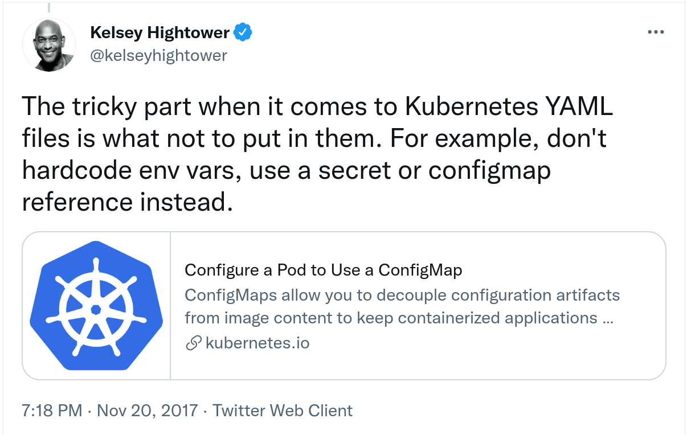

[](https://creativecommons.org/licenses/by-sa/4.0/)
[](http://makeapullrequest.com)


<p align="center">
  
</p>

#  Workload and scheduling

## Discussions:  
   You can use `CNCF Slack #certifications channel`  https://cloud-native.slack.com/archives/CLQT6RZAM


## Tips

- Always remember your context and namespace.
- [Use autocompletion](https://kubernetes.io/docs/tasks/tools/included/optional-kubectl-configs-bash-linux/)
  ```
  echo 'source <(kubectl completion bash)' >>~/.bashrc
  echo 'alias k=kubectl' >>~/.bashrc
  echo 'complete -F __start_kubectl k' >>~/.bashrc
  exec $SHELL    #for bashrc to get executed with the new mods
  ```
  
  You might need to source the profile shell script `source  /etc/profile.d/bash_completion.sh`
  
  ```
  k get pods
  NAME       READY   STATUS    RESTARTS   AGE
  test-pod   1/1     Running   0          2m18s
  ```
- Familiarize yourself with Kuberentios.io docuemntaion
  - Cheatsheet  https://kubernetes.io/docs/reference/kubectl/cheatsheet/
    - Familiarize yourelf how to generate or format outputs:  https://kubernetes.io/docs/reference/kubectl/cheatsheet/#formatting-output 
    - Free YAML and jsonpath course from kodekloud https://legacy.kodekloud.com/p/json-path-quiz
  - Tasks  https://kubernetes.io/docs/tasks/
  - Concepts https://kubernetes.io/docs/concepts/


## practice cluster
```
$ cat kind/two-nodes.yaml 
kind: Cluster
apiVersion: kind.x-k8s.io/v1alpha4
name: vmug-cka
nodes:
- role: control-plane
  image: kindest/node:v1.21.2 
- role: worker
  image:  kindest/node:v1.21.2
  
# create a two worker nodes cluster from the above config file
$kind create cluster --config kind/two-nodes.yaml
```
##  scope:

You need to be familiar with **Deployments**, **ConfigMaps & Secrets**, health probing, and defining **resource limits and requestes** needed by the containers running the application. When creating a new Pod, the Kubernetes scheduler places the object on an available node. Scheduling rules like **node affinity and taints/tolerations** control and fine-tunes the behavior.


## Data requirements:

- decoupling across environments (e.g public, private, dev, qa, prod)
- scalable sharing of configuration
- Enables immutable images
- Security ( sharing of images, constraining data to specific accounts, keeping secrets out)
https://twitter.com/kelseyhightower/status/932644210997465089



### passing data directly to command arguments

<details><summary> Q1: create a pod named test-pod running in vmug-cka namespace using image busybox configued with the sleep command to run for an hour     </summary>
   
 ```  

 $ export DO='-o yaml --dry-run=client'
 
 $ kubectl -n vmug-cka run $DO test-pod --image busybox -- sleep 1h|tee test-pod.yaml
 apiVersion: v1
 kind: Pod
 metadata:
   creationTimestamp: null
   labels:
     run: test-pod
   name: test-pod
   namespace: vmug-cka
 spec:
   containers:
   - args:
     - sleep
     - 1h
     image: busybox
     name: test-pod
     resources: {}
   dnsPolicy: ClusterFirst
   restartPolicy: Always
 status: {}
  
 $ kubectl create  -f test-pod.yaml 
 pod/test-pod created
 $ k get pods -n vmug-cka
 NAME       READY   STATUS    RESTARTS   AGE
 test-pod   1/1     Running   0          11s
```
   
 </details>

### Environment variables

<details><summary> Q2: create a pod named env-pod running in vmug-cka namespace using image busybox configued with the sleep command to run for an hour, and sets the following environment variables SERVER=vcsa.home.local, USER=admin@vsphere.local, PASS=N1N5ecur3   </summary>
         
```

	$ kubectl -n vmug-cka run $DO env-pod --image busybox --env SERVER=vcsa.home.local --env USER=admin@vsphere.local --env PASS=N0N5ecur3 -- sleep 1h|tee test-pod.yaml
	apiVersion: v1
	kind: Pod
	metadata:
	  creationTimestamp: null
	  labels:
	    run: env-pod
	  name: env-pod
	  namespace: vmug-cka
	spec:
	  containers:
	  - args:
	    - sleep
	    - 1h
	    env:
	    - name: SERVER
	      value: vcsa.home.local
	    - name: USER
	      value: admin@vsphere.local
	    - name: PASS
	      value: N0N5ecur3
	    image: busybox
	    name: env-pod
	    resources: {}
	  dnsPolicy: ClusterFirst
	  restartPolicy: Always
	status: {}

   ```
 
   </details>

  <details>
  <summary>
   Q3: list the user set enviornment variables only; if that was an exam question they might direct you to store them in a file
  </summary>


  ```

  $ kubectl set env pod/env-pod  -n vmug-cka --list
  # Pod env-pod, container env-pod
  SERVER=vcsa.home.local
  USER=admin@vsphere.local
  PASS=N0N5ecur3

  ```

  </details>


### Configmaps

### secrets


## Configurations

kubectl apply manifests/pod-envfrom-cm.yaml

```

### try as much as possible what could go wrong

wal@Bei:~/code/gitrepos/cert-magic$ kubectl get pods
NAME             READY   STATUS                       RESTARTS   AGE
configured-pod   0/1     CreateContainerConfigError   0          89s

### use events and describe pod to investiage errors

wal@Bei:~/code/gitrepos/cert-magic$ kubectl get events|grep  Warning
0s          Warning   Failed                    pod/configured-pod   Error: configmap "backend-config" not found


...
...
Events:
  Type     Reason     Age                   From               Message
  ----     ------     ----                  ----               -------
  Normal   Scheduled  4m6s                  default-scheduler  Successfully assigned default/configured-pod to localhost
  Warning  Failed     113s (x12 over 4m7s)  kubelet            Error: configmap "backend-config" not found
  Normal   Pulled     98s (x13 over 4m7s)   kubelet            Container image "nginx:1.19.0" already present on machine


```

the fix?

```
wal@Bei:~/code/gitrepos/cert-magic$ kubectl apply -f manifests/backend-cm.yaml 
configmap/backend-config configured

wal@Bei:~/code/gitrepos/cert-magic$ kubectl exec  -it configured-pod -- env|grep data
database_url=jdbc:postgresql://localhost/test
database_user=saiyam
database_env=staging

```


## Secrets
- []()

<details>
<summary>  Q1: Create a secret to hold the following govc credential, the secret name is called govc-creds, in name space vmug-cka, the secret should hold the following key value pairs:  server = vcsa.home.local, user =' administrator@vsphere.local', password = 'Admin!23', port = 443, insecure-flag = 1
	
</summary>
	
```
kubectl -n vmug-cka create secret generic govc-creds --from-literal=server=vcsa.home.local --from-literal=user='administrator@vsphere.local' --from-literal=password='Admin!23' --from-literal=port=443 --from-literal=insecure-flag=1 $DO
```
```	
apiVersion: v1
data:
  insecure-flag: MQ==
  password: QWRtaW4hMjM=
  port: NDQz
  server: dmNzYS5ob21lLmxvY2Fs
  user: YWRtaW5pc3RyYXRvckB2c3BoZXJlLmxvY2Fs
kind: Secret
metadata:
  creationTimestamp: null
  name: govc-creds
  namespace: vmug-cka

```
	
</details>

<details>
<summary>  Q2:
	use the kubectl --template option to print out the above secret govc-cred password key decoded in clear-text
</summary>
	
```
echo `kubectl get  secret govc-creds -n vmug-cka --template={{.data.password}}|base64 -d`
```
```	
Admin!23
```
	
```	
###*  the template argument was built based on the secret schema as you can see below if we use describe *###
kubectl describe -n vmug-cka secret govc-creds
Name:         govc-creds
Namespace:    vmug-cka
Labels:       <none>
Annotations:  <none>

Type:  Opaque

Data
====
user:           27 bytes
insecure-flag:  1 bytes
password:       8 bytes
port:           3 bytes
server:         15 bytes


```
	
</details>

</details>

<details>
<summary>  Q:
	
</summary>
	
```

```
```	


```
	
</details>


### kubectl set   env --help
```
Examples:
  # Update deployment 'registry' with a new environment variable
  kubectl set env deployment/registry STORAGE_DIR=/local
  
  # List the environment variables defined on a deployments 'sample-build'
  kubectl set env deployment/sample-build --list
  
  # List the environment variables defined on all pods
  kubectl set env pods --all --list
  
  # Output modified deployment in YAML, and does not alter the object on the server
  kubectl set env deployment/sample-build STORAGE_DIR=/data -o yaml
  
  # Update all containers in all replication controllers in the project to have ENV=prod
  kubectl set env rc --all ENV=prod
  
  # Import environment from a secret
  kubectl set env --from=secret/mysecret deployment/myapp
  
  # Import environment from a config map with a prefix
  kubectl set env --from=configmap/myconfigmap --prefix=MYSQL_ deployment/myapp
  
  # Import specific keys from a config map
  kubectl set env --keys=my-example-key --from=configmap/myconfigmap deployment/myapp
  
  # Remove the environment variable ENV from container 'c1' in all deployment configs
  kubectl set env deployments --all --containers="c1" ENV-
  
  # Remove the environment variable ENV from a deployment definition on disk and
  # update the deployment config on the server
  kubectl set env -f deploy.json ENV-
  
  # Set some of the local shell environment into a deployment config on the server
  env | grep RAILS_ | kubectl set env -e - deployment/registry
```

### kubectl set   env --help

